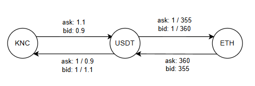
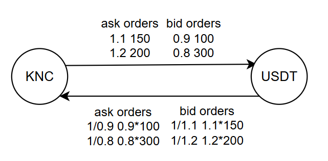
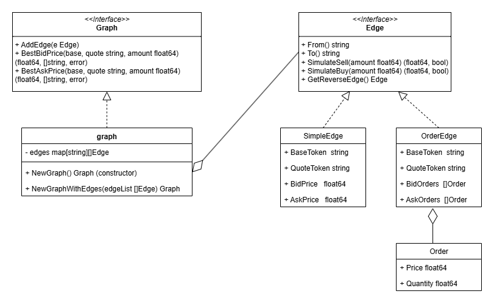

# Simple problem & Expanded problem
## Chạy chương trình
Cập nhật input trong file `test/simple_input.txt` đối với simple problem hoặc
`test/expanded_input.txt` đối với expanded problem

Chạy lệnh
```
go run cmd/simple/main.go

go run cmd/expanded/main.go
```

## Ý tưởng
### Mô hình hóa bài toán
Mô hình hóa bài toán theo hướng graph. Coi mỗi loại `currency` là một `đỉnh`
trong graph. Theo đó, mỗi `trading pair` tương ứng với hai `cạnh`:
- Cạnh 1: chiều từ đỉnh 1 `base currency` sang đỉnh 2 `quote currency`. Trọng số
  tương ứng sẽ là `bid price` và `ask price`
- Cạnh 2: chiều từ đỉnh 2 `quote currency` sang đỉnh 1 `base currency`. Trọng số
  tương ứng là `1 / ask price` và `1 / bid price` do đảo chiều

Đối với input của đề bài ta có thể thể hiện dạng graph như sau:
```
KNC ETH
2
KNC USDT 1.1 0.9
ETH USDT 360 355
```


Trong expanded problem, mỗi trading pair thay ask/bid price cố định bằng
ask/bid orders với thanh khoản giới hạn, có thể biểu diễn hai cạnh như sau:
```
KNC USDT
2
1.1 150
1.2 200
2
0.9 100
0.8 300
```


### Giải pháp

Yêu cầu đề bài:

**Best Bid Price (Selling the Base Currency):** Bán một lượng x `base currency`
sao cho thu được nhiều `quote currency` nhất
- Đối với simple problem, x = 1, cần tìm route từ `base currency` về
  `quote currency` sao cho lượng token tại quote là lớn nhất, sau đó nhân bid
  price của các cạnh với nhau. Có thể sử dụng thuật toán Bellman-Ford với trọng
  số các cạnh là `-log(bid_price)` để đảo phép nhân về phép cộng, và tìm max
  thay vì tìm min. Ngoài ra, Bellman-Ford có thể detect được chu trình âm (vòng
  lặp lợi nhận vô hạn), mặc dù thực tế ít xảy ra. Tuy nhiên cách này chỉ hoạt
  động với simple problem, mình sẽ tìm một giải pháp tổng quát hơn.
- Đối với expanded problem, x có thể là số bất kỳ > 0, và mỗi cạnh đều có một
  mức mua tối đa phụ thuộc vào bid orders. Nên không phải cạnh nào cũng đi
  được. Để kiểm tra thì luôn phải biết trước lượng base token cần bán trước khi
  đi vào cạnh. Do đó, có thể dùng một biến thể của Bellman-Ford khởi tạo đỉnh
  xuất phát bằng x, mỗi cạnh giả lập việc bán `SimulateSell` và cập nhật đỉnh
  liền kề nếu thu được lượng token lớn hơn. Thuật toán này tổng quát cho cả
  simple problem với x = 1 với `SimulateSell` luôn thành công.

**Best Ask Price (Buying the Base Currency):** Mua một lượng x `base currency`
sao cho cần ít `quote currency` nhất
- Đối với simple problem, x = 1, chỉ cần tìm route từ `base currency` về
  `quote currency`, nhân ask price các cạnh sẽ ra được best ask price. Đảm bảo
  sao cho best ask price là min và đảo route sẽ được đường từ `quote` về `base`.
  Tương tự, dùng Bellman-Ford với trọng số các cạnh là `log(ask_price)` để né
  phép nhân hoặc Dijkstra nếu không xét đến chu trình âm.
- Đối với expanded problem, x có thể là số bất kỳ > 0, và mỗi cạnh có đi được
  không phụ thuộc vào ask orders. Do đó, mình sẽ thiết lập chi phí đỉnh base là
  x thay vì 0 trong thuật toán thông thường, qua mỗi cạnh sẽ giả lập việc mua
  `SimulateBuy` và cập nhật đỉnh liền kề nếu require lượng token nhỏ hơn. Thuật
  toán này tổng quát cho cả simple problem với x = 1, với `SimulateBuy` luôn
  thành công.

## Thiết kế
Mình sẽ thiết kế một interface tổng quát cho cả simple và expanded problem vì
bản chất, simple problem là expanded problem với lượng token cần mua/bán x = 1
và các cạnh có thanh khoản vô hạn, nghĩa là luôn có thể đi qua.

Để sử dụng chỉ cần khởi tạo Graph bằng hàm `NewGraph` hoặc `NewGraphWithEdges`
và gọi các hàm `BestBidPrice` và `BestAskPrice` để tính toán. Các hàm này trả 
về lỗi khi không tìm được trade route hoặc xuất hiện arbitrage loop.



## Cài đặt
## Cải tiến
1. Cài đặt nhiều thuật toán tìm đường khác để chạy song song khi tìm best 
bid/ask price, và dùng Done Channel Pattern để kết thúc cạnh tranh.
2. Xử lý vòng lặp lợi nhuận vô hạn nếu thực tế có thể xảy ra.