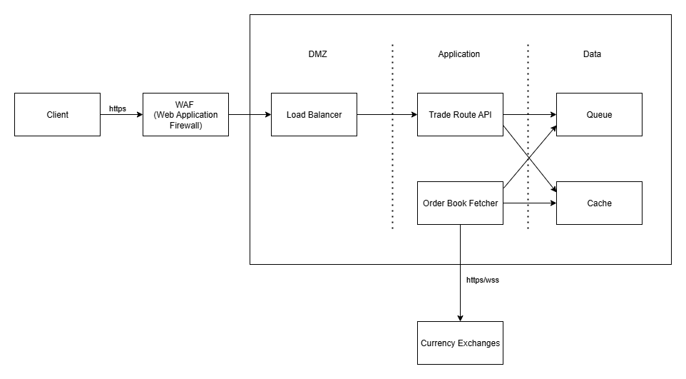
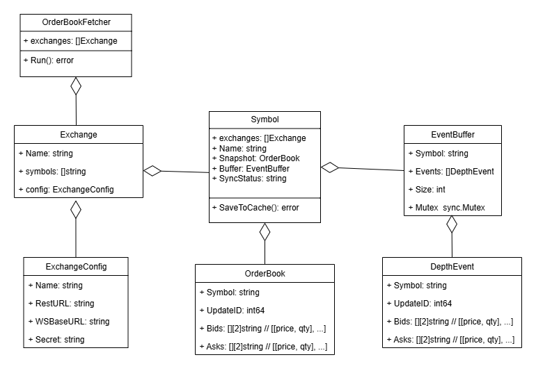

# System design problem
## Step 1: Outline use cases, constraints, and assumptions
### Use cases (Functional Requirements)
Phạm vi hệ thống chỉ xử lý các use cases sau:
- **Service** fetch order book data từ cryptocurrency exchange:
    - Fetch real-time order book data từ exchange.
    - Lưu và cập nhật order book data nếu có thay đổi.
- **User** query best trade route và best trade price:
    - **REST API Endpoint**: input starting `token Y`, target `token X`, trade amount `n` (units of token X). API trả về:
        - The lowest effective ask price when buying n units of Token X và best ask route.
        - The highest effective bid price when selling n units of Token X và best bid route.
    - **Multi-Hop Trading Support**: Consider multiple market pairs if a direct trading pair does not exist.

Out of scope:
- Lưu trữ lâu dài order book phục vụ aggregation về sau
- Trade route tối ưu nằm trên nhiều exchanges

### Constraints and assumptions (Non-Functional Requirements)
Các ràng buộc đưa ra bởi đề bài:
- **Low Latency**: API đưa ra near real-time responses. Order book data cũng được fetch real-time.
- **High Availability**: The system should be resilient to API failures from exchanges.
- **Scalability**: The architecture should handle multiple exchanges and large trading volumes.
- **Fault Tolerance**: Ensure fallback mechanisms in case of API failures or data inconsistencies.
- **Security**: Secure API endpoints and prevent abuse (e.g., rate limiting).

Các con số:
- Giả định tích hợp 100 exchanges, mỗi exchange có khoảng
 1500 symbols hoạt động (thực tế Binance đang có 1454). 
 Hệ thống liên tục fetch và lưu order book của toàn bộ 100
 exchanges này.

- Mỗi exchange đều hỗ trợ:
    - API fetch toàn bộ order book của symbol, truyền vào symbol và depth. 
    Binance thực hiện rate limit theo weight, mỗi
 API đều tính weight, giới hạn 6000 weight/IP/phút. Weight
 sẽ tương ứng với depth như sau:

        | weight | depth       |
        | ------ | -------     |
        | 5      | 1 - 100     |
        | 25     | 101 - 500   |
        | 50     | 501 - 1000  |
        | 250    | 1001 - 5000 |
    - Kết nối websocket, cho phép lắng nghe các thay đổi 
    trên order book của một hoặc một danh sách các symbol. Mỗi kết nối listen tối đa 1024
 streams (symbols), sau 24h sẽ bị ngắt kết nối. Mỗi IP 
 cho phép tạo tối đa 300 connections mỗi 5 phút.

## Step 2: Create a high level design
High level design chỉ thể hiện các components quan trọng trong hệ thống, chưa tính đến các con số. Các ràng buộc, hay giả định số liệu về hệ thống sẽ giải quyết mục **Step 4: Scale the design**



## Step 3: Design core components

### Use case: Service fetch order book data từ cryptocurrency exchange
Hai nhiệm vụ chính:
- Fetch real-time order book data từ exchange.
- Lưu và cập nhật order book data nếu có thay đổi.

Lưu danh sách 100 exchanges và metadata (url, api key,...) vào bảng `exchanges` (SQL hoặc NoSQL), hoặc file cấu hình, 
do đây là thông tin ít thay đổi.

Với mỗi exchange, Order Book Fetcher Service thực hiện :
- Lấy danh sách symbol đang hoạt động trên exchange sử 
dụng API. Thu được khoảng 1500 symbols.
- Tạo kết nối websocket tới exchange. Đảm bảo mỗi kết 
 nối lắng nghe tối đa 1024 streams, mỗi IP tối đa 300 kết
 nối. Do đó mình sẽ tạo khoảng `10 kết nối`, mỗi kết nối 
 lắng nghe `150 streams (symbols)`. Có thể benchmark sau để
 tìm con số tối ưu hơn. Sau khi nghe được, publish event này vào `Queue` cho các service khác sử dụng nếu cần.
- Buffer các events nhận được từ streams. Với mỗi symbol, 
lưu lại update_id `U` của event đầu tiên nhận được. Phần này dùng queue với kích thước cố định cho mỗi symbol để tránh buffer quá nhiều event, khiến RAM quá tải.
- Với mỗi symbol:
    - Dùng API fetch order book để get order book snapshot. Do rate limit 6000 weight/IP/phút, nên module này sẽ không fetch toàn bộ 1500 symbols cùng lúc. Tùy thuộc vào depth yêu cầu, ta giới hạn số lần fetch trên phút tương ứng. VD: depth 1000 (weight tốn 50), mỗi phút chỉ fetch 100 symbols, đâu đó tốn khoảng 5000 (đảm bảo < 6000). Ưu tiên fetch các events có buffer đầy.
    - So sánh snapshot.update_id với update_id của event đầu tiên trong event buffer của symbol này.
    - Nếu nhỏ hơn, thì gọi lại API để lấy snapshot mới.
    - Nếu lớn hơn thì loại bỏ các event có update_id < snapshot.update_id trong buffer event. Ta thu được 
    danh sách events để apply vào snapshot.
    - Với mỗi event, bao gồm bid orders và ask orders, mỗi order có price và quantity, thực hiện apply như sau:
        - Nếu price chưa có trong snapshot, insert price với quantity vào snapshot.
        - Nếu price đã có trong snapshot, xét tiếp quantity. Nếu quantity = 0 thì remove price khỏi snapshot, quantity > 0 thì cập nhật quantity của price.
        - Cập nhật snapshot.update_id bằng update_id của event vừa apply.
        - -> *price để là string để so sánh chính xác, không nên convert ra float ngay*
    - Khi apply hết event trong buffer, flush symbol xuống `Cache` với key orderbook:<exchange>:<symbol> dạng JSON, để dùng cho các service khác. Đối với các symbol trade nhiều, có thể chuyển qua chiến lược update sau mỗi 1, 2s.

Cài đặt khuyến nghị:


// Nháp:
Nếu fetch 1500 symbol thì mỗi symbol 
nhận được weight = 4, tương đương depth = 80. Đến 1 phút sau mới được fetch 
tiếp, không đảm bảo fetch real-time. Do đó: 
- Chỉ sử dụng API để fetch order book snapshot ban đầu hoặc trường hợp bị 
out-of-sync, sau đó chuyển qua websocket để nhận cập nhật. 
- Nếu cần fetch depth lớn, có thể sử dụng proxy/IP rotation.
- Khi fetch thì nên ưu tiên depth cao cho top trade token, và giảm depth của 
token còn lại.

## Tham khảo
Cách lấy số lượng trading pair (symbol) đang hoạt động trên Binance
```
	client := binance_connector.NewClient(apiKey, secretKey, baseURL)
	exchangeInfo, _ := client.NewExchangeInfoService().SymbolStatus("TRADING").Do(context.Background())
	fmt.Println(len(exchangeInfo.Symbols))
```

[Binance - How to manage a local order book correctly](https://developers.binance.com/docs/derivatives/usds-margined-futures/websocket-market-streams/How-to-manage-a-local-order-book-correctly)

