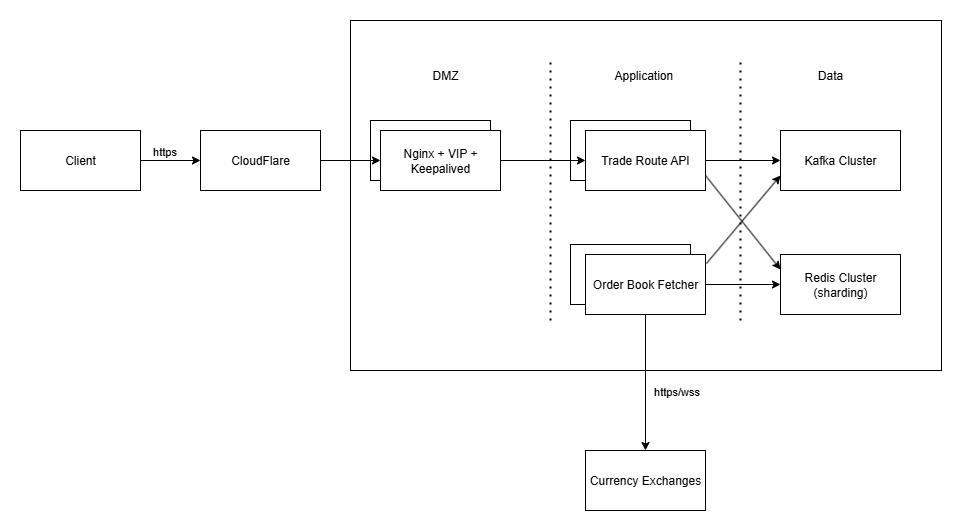

# System design problem

## Step 1: Outline use cases, constraints, and assumptions

### Use cases (Functional Requirements)

Phạm vi hệ thống chỉ xử lý các use cases sau:

- **Service** fetch order book data từ cryptocurrency exchange:
    - Fetch real-time order book data từ exchange.
    - Lưu và cập nhật order book data nếu có thay đổi.
- **User** query best trade route và best trade price:
    - **REST API Endpoint**: input starting `token Y`, target `token X`, trade amount `n` (units of token X). API trả về:
        - The lowest effective ask price when buying n units of Token X và best ask route.
        - The highest effective bid price when selling n units of Token X và best bid route.
    - **Multi-Hop Trading Support**: Consider multiple market pairs if a direct trading pair does not exist.

Out of scope:

- Lưu trữ lâu dài order book phục vụ aggregation về sau. Trong phạm vi hệ thống này, mình chỉ lưu thông tin order book hiện tại.
- Trade route tối ưu nằm trên nhiều exchanges.

### Constraints and assumptions (Non-Functional Requirements)

Các ràng buộc đưa ra bởi đề bài:

- **Low Latency**: API đưa ra near real-time responses. Order book data cũng được fetch real-time.
- **High Availability**: The system should be resilient to API failures from exchanges.
- **Scalability**: The architecture should handle multiple exchanges and large trading volumes.
- **Fault Tolerance**: Ensure fallback mechanisms in case of API failures or data inconsistencies.
- **Security**: Secure API endpoints and prevent abuse (e.g., rate limiting).

Các con số giả định:

- Giả định tích hợp 100 exchanges, mỗi exchange có khoảng 1500 symbols hoạt động (thực tế Binance đang có 1454). Hệ thống liên tục fetch và lưu order book của toàn bộ 100 exchanges này.
- Mỗi exchange đều hỗ trợ:
    - API fetch toàn bộ order book của symbol, truyền vào symbol và depth. Binance thực hiện rate limit theo weight, mỗi API đều tính weight, giới hạn 6000 weight/IP/phút. Weight
    sẽ tương ứng với depth như sau:
        
        
        | weight | depth |
        | --- | --- |
        | 5 | 1 - 100 |
        | 25 | 101 - 500 |
        | 50 | 501 - 1000 |
        | 250 | 1001 - 5000 |
    - Kết nối websocket, cho phép lắng nghe các thay đổi trên order book của một hoặc một danh sách các symbol. Mỗi kết nối listen tối đa 1024 streams (symbols), sau 24h sẽ bị ngắt kết nối. Mỗi IP cho phép tạo tối đa 300 connections mỗi 5 phút.

## Step 2: Create a high level design

> Lưu ý: High level design tạm thời chỉ ra các components quan trọng trong hệ thống. Các yếu tố như định cỡ, tính toán mức độ sử dụng, cluster, chọn lựa công nghệ, sẽ lần lượt được bàn luận ở **Step 3 Design core components** và **Step 4 Scale the design**. Ở Step 2 ta chưa vội tính đến các yếu tố này, để giữ cái nhìn tổng thể, tránh đi vào chi tiết quá sớm.
> 

Danh sách các components trong hệ thống:

- `Order Book Fetcher Service`: làm nhiệm vụ fetch order book data real-time từ các exchanges, qua kết nối API và websocket. Trong phạm vi bài toán, order book data cần truy xuất nhanh và không cần lưu trữ lâu dài, nên mình chọn lưu vào in memory `Cache`, các event nhận được qua websocket ngoài tổng hợp vào order book sẽ chuyển tiếp vào `Queue`.
- `Trade Route API`: cung cấp API **Optimal Trade Route Calculation** cho người dùng, ****dựa vào dữ liệu order book tổng hợp bởi **Order Book Fetcher Service** lưu ở `Cache` và `Queue` .
- `Cache`: lưu trữ các bản snapshot của order book từ các exchanges.
- `Queue`: lưu các order book events exchange đẩy qua websocket.
- `Load Balancer`: đảm bảo HA cho `Trade Route API`
- `WAF` (Web Application Firewall): các API public cho `Client` đặt sau WAF như CloudFlare để được bảo vệ, hoặc cảnh báo khi bị tấn công, bị DDoS.

Hai components `Order Book Fetcher Service` và `Trade Route API` hoàn toàn có thể nằm chung process và trao đổi in memory mà không cần `Cache` hay `Queue` . Cách làm này ít phức tạp và tốc độ tốt hơn. Tuy nhiên mình vẫn thiết kế như vậy để đảm bảo scale ra nhiều process khác nhau, dễ mở rộng. Đây là một tradeoff.


## Step 3: Design core components

### Use case: Service fetch order book data từ cryptocurrency exchange

Use case này thuộc `Order Book Fetcher Service` . Hai nhiệm vụ chính:

- Fetch real-time order book data từ exchange.
- Lưu và cập nhật order book data nếu có thay đổi.

Đầu tiên, lưu danh sách 100 exchanges và metadata (url, api key,...) vào bảng `exchanges` (SQL hoặc NoSQL), hoặc file cấu hình, do đây là thông tin ít thay đổi. Ta chọn lưu vào cấu hình của `Order Book Fetcher Service` và cho phép quản lý cấu hình tập trung qua Consul, tự động reload khi cấu hình thay đổi.

Với mỗi exchange, `Order Book Fetcher Service` thực hiện :

- Lấy danh sách symbols đang hoạt động trên exchange sử dụng API. Thu được khoảng 1500 symbols.
- Tạo kết nối websocket tới exchange. Do mỗi kết nối lắng nghe tối đa 1024 streams, mỗi IP tối đa 300 kết nối, nên mình sẽ tạo `10 kết nối`, mỗi kết nối lắng nghe `150 streams (symbols)`. Sau khi nghe được, publish event này vào `Queue` cho các service khác sử dụng → 100 exchanges x 10 kết nối = 1000 kết nối websocket đi ra (không đáng kể).
- Buffer các events nhận được từ streams. Với mỗi symbol, lưu lại update_id của event đầu tiên nhận được. Mỗi symbol có một queue buffer với kích thước cố định `1000` để tránh buffer quá nhiều event, khiến RAM quá tải → giả định mỗi symbol buffer 0.5 KB. Tổng 100 exchanges x 1500 symbol * 0.5 KB ~ 70 MB RAM.
- Với mỗi symbol:
    - Dùng API fetch order book để get order book snapshot. Do rate limit 6000 weight/IP/phút, nên module này sẽ không fetch toàn bộ 1500 symbols cùng lúc. Tùy thuộc vào depth yêu cầu, ta giới hạn số lần fetch trên phút tương ứng. VD: depth 1000 (weight tốn 50), mỗi phút chỉ fetch 100 symbols, đâu đó tốn khoảng 5000 (đảm bảo < 6000). Ưu tiên fetch các events có buffer đầy, dùng max heap để nhận biết.
    - So sánh snapshot.update_id với update_id của event đầu tiên trong event buffer của symbol này.
    - Nếu nhỏ hơn, thì gọi lại API để lấy snapshot mới.
    - Nếu lớn hơn thì loại bỏ các event có update_id < snapshot.update_id trong buffer event. Ta thu được
    danh sách events để apply vào snapshot.
    - Với mỗi event, bao gồm bid orders và ask orders, mỗi order có price và quantity, thực hiện apply như sau (*price để là string để so sánh chính xác, không nên convert ra float ngay)*:
        - Nếu price chưa có trong snapshot, insert price với quantity vào snapshot.
        - Nếu price đã có trong snapshot, xét tiếp quantity. Nếu quantity = 0 thì remove price khỏi snapshot, quantity > 0 thì cập nhật quantity của price.
        - Cập nhật snapshot.update_id bằng update_id của event vừa apply.
    - Khi apply hết event trong buffer, flush symbol xuống `Cache` để dùng cho các service khác. Đối với các symbol trade nhiều, chuyển qua chiến lược update sau mỗi 1, 2s.:
        - key `orderbook:<exchange>:<symbol>`
        - value dạng JSON
        
        ```json
        {
            "lastUpdateId": 72517033095,
            "bids": [
                [
                    "111295.49000000",
                    "0.01811000"
                ]
            ],
            "asks": [
                [
                    "111295.50000000",
                    "9.84350000"
                ]
            ]
        }
        ```
        

Cài đặt khuyến nghị:


### Use case: **User** query best trade route và best trade price

Use case này thuộc `Trade Route API` , nhiệm vụ chính cung cấp API **Optimal Trade Route Calculation** cho người dùng.

Khi khởi động lên, `Trade Route API` cần:

- Load dữ liệu order book từ `Cache` , và listen các thay đổi order book từ `Queue` . Cơ chế snapshot và update tương tự `Order Book Fetcher Service` nên mình không nhắc lại.
- Xây dựng đồ thị giao dịch cho từng exchange (100 exchanges)
- Sẵn sàng trả lời route query ngay sau khởi động

Luồng người dùng gọi API sẽ diễn ra như sau:

- `Client` gửi request tới server, traffic qua `WAF` trước sau đó được chuyển về `Load Balancer`
- `Load Balancer` forward request về `Trade Route API` và đảm bảo HA, tránh Single Point Of Failure.
- `Trade Route API` thực hiện:
    - Parse query param, lấy starting token Y, target token X, trading amount n.
    - Run bài toán tìm đường đồng thời trên các exchanges đã được load lên (không cố để chờ load all exchanges), mỗi exchange chạy trong một luồng song song độc lập. Thuật toán sử dụng tham khảo Expanded Problem, đã bao gồm class diagram.
    - So sánh kết quả các sàn, tìm giá tốt nhất, và trả về cho người dùng.

API

```bash
curl 'https://api.trading.com/best-swap?starting_token=KNC&target_token=ETH&amount=100'

// Response
{
    "bid": {
        "route": ["KNC", "USDT", "ETH"],
        "price": "0.00250"
    },
    "ask": {
        "route": ["ETH", "KNC"],
        "price": "0.00310"
    }
}
```

## Step 4: **Scale the design**

> Xác định và giải quyết các bottlenecks.
> 



Băng thông hệ thống:

- Ở mục 3, mình thống nhất mỗi phút sẽ fetch 100 exchanges x 100 symbols = 10^4 symbols, mỗi symbol lấy depth là 1000. Mình test với Binance, depth = 5000 ~ 50 KB traffic chưa nén/1 symbol. Do đó băng thông cần cho snapshot = 10^4 * 50 / 5 = 10^5 KB ~ 100 MB/phút ~ 13 Mbit/s.
- Ngoài gọi API depth để lấy snapshot, mình cũng listen toàn bộ events của 100 exchanges x 1500 symbols qua websocket. Giả định mỗi symbol trung bình 2 KB/s. Tổng băng thông ~ 2.2 Gbit/s.

```bash
BTCUSDT
Events/s: 1    | Data/s: 2005   bytes (1.96 KB)
Events/s: 1    | Data/s: 1772   bytes (1.73 KB)
Events/s: 1    | Data/s: 1412   bytes (1.38 KB)
Events/s: 1    | Data/s: 2567   bytes (2.51 KB)
Events/s: 1    | Data/s: 5211   bytes (5.09 KB)
Events/s: 1    | Data/s: 15997  bytes (15.62 KB)
Events/s: 1    | Data/s: 7023   bytes (6.86 KB)
Events/s: 1    | Data/s: 4745   bytes (4.63 KB)
Events/s: 1    | Data/s: 2071   bytes (2.02 KB)
Events/s: 1    | Data/s: 1477   bytes (1.44 KB)
```

→ Khuyến nghị dùng card mạng 10 Gbps cho máy chủ để tránh bottleneck. Riêng băng thông đổ về từ exchanges đã chiếm hơn 2 Gbps.

RAM:

- `Order Book Fetcher Service` buffer mỗi symbol 1000 event, như tính toán ở trên, toàn bộ 100 exchange chiếm ~ 70 MB memory
- `Order Book Fetcher Service` cũng phải hold toàn bộ snapshot order book của các symbols, mỗi symbol 10 KB, tổng 100 x 1500 symbols cần ~ 1.5 GB memory
- `Cache` cần hold được tối thiểu lượng 1.5 GB.
- `Trade Route API` cần load order book từ cache lên và hold buffer giống `Order Book Fetcher Service` nên cần tối thiểu 1.5 GB

→ Khuyến nghị `Cache` , `Order Book Fetcher Service`, `Trade Route API` mỗi tiến trình tối thiểu 2 GB RAM để tránh bị out of memory.

I/O và message throughput:

- `Order Book Fetcher Service` listen toàn bộ events của 100 exchanges x 1500 symbols qua websocket với tần suất 1 event/s (update speed mặc định của Binance). Tổng 150K events/s khá lớn. Cần benchmark thêm xem chính xác một worker xử lý được bao nhiêu events/s. Đề xuất cách tiếp cận mỗi exchange có một worker riêng để xử lý khoảng 1.5K events/s.
- `Queue` nhận 150K event/s từ `Order Book Fetcher Service` . Một Kafka cluster 5 nodes là có thể tiếp nhận lượng tải này, dùng exchange name là key, ta tạo 100 partitions để consumer xử lý song song.
- Phía `Trading Route API` cũng nên tạo đủ 100 workers để xử lý hết 150K events/s
- `Order Book Fetcher Service` flush xuống `Cache` trung bình 1 - 2s một lần, `Cache` chịu khoảng 75K - 150K write/s. Một server Redis trung bình có thể đáp ứng con số này [benchmarks](https://redis.io/docs/latest/operate/oss_and_stack/management/optimization/benchmarks)

→ Dùng Kafka cluster cho `Queue`, tạo một topic cho depth event, partition = 100, replica = 2. Dùng Redis cho `Cache`.

CPU:

- Thường CPU phải phát triển một version và thực hiện benchmark mới ra được con số.

Khi số lượng exchange và trading volume tăng lên:

- Chia nhỏ list exchanges ra và start nhiều process `Order Book Fetcher Service` , mỗi process phụ trách một số exchanges để tránh message throughput quá lớn.
- Dựng Redis cluster để tận dụng sharding, scale việc ghi và đảm bảo HA
- Thêm node cho Kafka cluster

Khi số lượng request vào API tăng:

- Scale nhiều instance `Trading Route API` và phân tải bằng `Load Balancer` . Thực ra bình thường cũng phải chạy LB để đảm bảo HA.
- Tùy vào TPS vào hệ thống để chọn `Load Balancer` . Một reverse proxy layer 7 trung bình như Nginx có thể phục vụ trung bình hàng chục nghìn TPS. Mình chọn Nginx làm `Load Balancer` và dùng VIP + Keepalived để HA cho Nginx.

Giải quyết các non-functional requirements còn lại:

- **Low Latency**: API đưa ra near real-time responses.
    - Order book data được load vào memory, đảm bảo tìm optimal route nhanh nhất.
    - Tránh tìm đường theo xu hướng vét cạn nếu được, ở đây mình sử dụng các giải thuật như Bellman-Ford, Dijkstra.
- **High Availability**: The system should be resilient to API failures from exchanges.
    - Các exchage thường có thời hạn timeout cho API, như Binance là 10s. Khi request mình cũng đặt timeout cho request là 10s.
    - Retry theo exponential backoff sau 2 - 4 - 8 - 16 … tối đa 32s để tránh quá tải exchage.
    - Dùng Circuit Breaker pattern để trả về false nếu gọi API đang lỗi quá nhiều, nhằm bảo vệ server không phải đợi I/O quá lâu. Tự implement hoặc dùng service mesh.
- **Scalability**: The architecture should handle multiple exchanges and large trading volumes.
    - Đã nêu ở trên
- **Fault Tolerance**: Ensure fallback mechanisms in case of API failures or data inconsistencies.
    - Dùng Circuit Breaker pattern để trả về false nếu gọi API đang lỗi quá nhiều, nhằm bảo vệ server không phải đợi I/O quá lâu. Tự implement hoặc dùng service mesh.
- **Security**: Secure API endpoints and prevent abuse (e.g., rate limiting).
    - Các API public nên bọc sau Web Application Firewall như CloudFlare, tránh tấn công và không phải implement nhiều.
    - Đối với rate limit có thể tự implement token bucket, sliding window,…Rate limit theo IP.

## Next step

Benchmark để verify design

## Tham khảo

[Binance - How to manage a local order book correctly](https://developers.binance.com/docs/derivatives/usds-margined-futures/websocket-market-streams/How-to-manage-a-local-order-book-correctly)